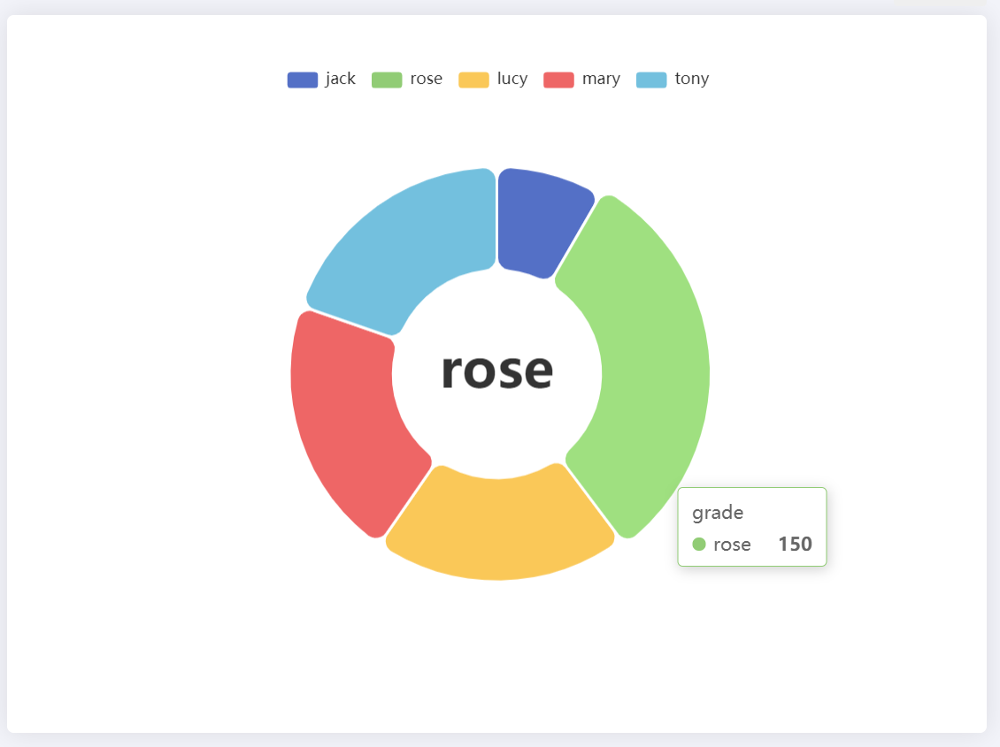

# achart

echarts 便捷组件化开发研发项目规划（初版需求，实现的功能，达到的目标）
ddChart，DDChart, ddchart, FChart, fchart, achart  (echartBuilder， optionBuilder)

	如何便捷化：尽量多的默认配置（约定大于配置）
	如何定制化：预留接口
	如何做好便捷和多样的平衡
	
	架构规划：
		- 计算，展示分离
		- 模块化
		- 自定义样式 & 配置
		- 后期考虑加入 d3
	功能规划：
		- 基于 echart 常用图表，简化常用功能
		- 数学 & 统计基础计算工具库
		- 常用图形简单实用
		- 便捷实用（默认设置，单一设置）


**Vue 组件，按图类型分。设置基本类型，给与基本参数即可作图；再增加自定义类型**


## 项目规划

### 一：缘起
	数据可视化需求日渐增加，但纵观市面上的产品，要么配置繁琐，要么 API 巨多，对于非专业人士，要搞明白这些配置项和概念，是一个不小的挑战，我只是想把我的数据变成图表而已……
	所以萌生，以约定大于配置为指导思想，以使用简单为目的开发一个工具，来降低一般场景下数据可视化的难度。

### 二：功能

1. 常用类型支持： bar, line，scatter，pie…… 
2. 提供工具便捷支持扩展其他类型 & 组合
3. 附带数据处理工具、数学 & 统计学工具

### 三：使用例子

#### 结合 Vue

```js
import achart from 'achart';
achart.default = {
    darkmode: false,
    align: 'bottom',
    zoomable: true,
}
```


##### Bar chart

```vue
// 使用 Vue 组件
<bar-chart v-series:grade="series" align="left" darkmode></bar-chart>

<script>
    const series = [
        {stuName: 'jack', grade: 100},
        {stuName: 'rose', grade: 90},
        {stuName: 'lucy', grade: 95},
        {stuName: 'mary', grade: 99},
        {stuName: 'tony', grade: 96},
    ]
    
    // 或者使用 OptionBuilder 构造 echart option ,可不限于配合 Vue 使用
    import {OptionBuilder} from 'achart';
    const valueKey = 'grade'
    const options = OptionBuilder.bar().series(series, valueKey)
    	.align('left').darkMode().nice();
    
    let echarts = echart.init(dom);
    echart.setOption(options);
</script>
```


##### Trend chart

```vue
// 使用 Vue 组件
<trend-chart v-series:grade="series" :ymargin="1" v-markLine.avg="平均值"
             :zoomable="false" autofit smooth></trend-chart>

<script>
    const series = [
        {stuName: 'jack', grade: 100},
        {stuName: 'rose', grade: 90},
        {stuName: 'lucy', grade: 95},
        {stuName: 'mary', grade: 99},
        {stuName: 'tony', grade: 94},
    ]
    
    // 或者使用 OptionBuilder 构造 echart option ,可不限于配合 Vue 使用
    import {OptionBuilder} from 'achart';
    const options = OptionBuilder.trend().series(series, 'grade')
    	.yMargin(1).markLine('avg', '平均值')
    	.zoomable(false).autoFit().smooth().nice();
    
    let echarts = echart.init(dom);
    echart.setOption(options);
</script>
```


##### Pie chart

```vue
// 使用 Vue 组件：
<pie-chart v-series:grade="series" :ring="{inner: '30%', outer: '60%'}"></pie-chart>

<script>
    const series = [
        {stuName: 'jack', grade: 40},
        {stuName: 'rose', grade: 150},
        {stuName: 'lucy', grade: 95},
        {stuName: 'mary', grade: 99},
        {stuName: 'tony', grade: 94},
    ]
    
// 或者使用 OptionBuilder 构造 echart option ,可不限于配合 Vue 使用
    import {OptionBuilder} from 'achart';
    const options = OptionBuilder.pie().series(series, 'grade').ring({inner: '30%', outer: '60%'}).nice();
    
    let echarts = echart.init(dom);
    echart.setOption(options);
</script>
```


​		
​		
​		
​		

## Project setup
```
yarn install
```

### Compiles and hot-reloads for development
```
yarn serve
```

### Compiles and minifies for production
```
yarn build
```

### Lints and fixes files
```
yarn lint
```

### Customize configuration
See [Configuration Reference](https://cli.vuejs.org/config/).
